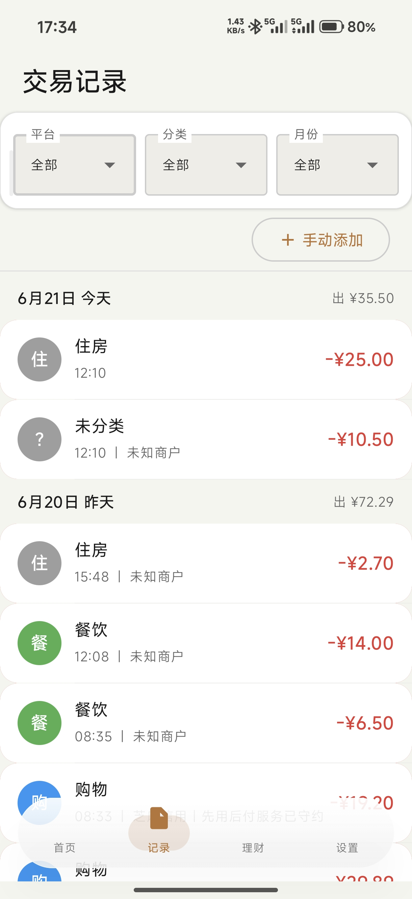
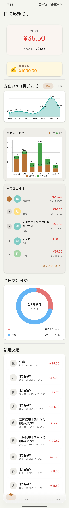
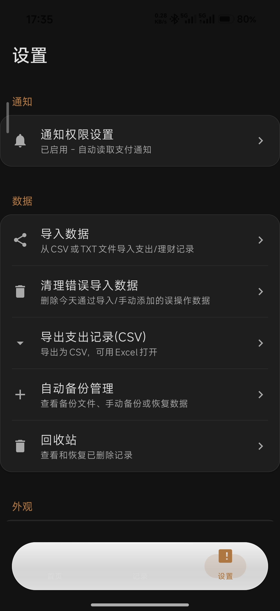

# 🪙 自动记账助手（AutoBookkeeper）

> 让每一笔消费都有迹可循 —— 一个独立开发者的记账 Side Project

[](https://github.com/sadrass05/autokeeper)
[](LICENSE)

---

## ⬇️ 下载安装

[](https://github.com/sadrass05/autokeeper/releases/latest)
[](https://github.com/sadrass05/autokeeper/releases/tag/v1.0.0-pro)

> 💡 **不知道选哪个？** 往下看版本对比 👇
>
> 📦 **下载方式说明：** 通过 GitHub Releases 分发，链接自动指向最新版本。点击上方按钮即可直接下载对应版本的 APK（Standard 选 `app-standard-release.apk`，Pro 选 `app-pro-release.apk`）。

### 📊 版本对比

| 功能 | Standard 版 | Pro 版 |
|------:|:----------:|:------:|
| 🔔 通知监听自动记账 | ✅ | ✅ |
| 📊 支出趋势图表 | ✅ | ✅ |
| 🥧 分类饼图 | ✅ | ✅ |
| 📤 CSV 导入导出 | ✅ | ✅ |
| 💾 每周自动备份 | ✅ | ✅ |
| 🌙 深色/浅色主题 | ✅ | ✅ |
| ✅ 数据一致性校验 | ✅ | ✅ |
| 🗑️ 软删除回收站 | ✅ | ✅ |
| 🛡️ NLS 健康监测 | ✅ | ✅ |
| 📱 ROM 引导设置 | ✅ | ✅ |
| 💹 理财持仓管理 | ❌ | ✅ |
| 📈 收益排行榜 | ❌ | ✅ |
| 🗄️ MySQL 数据同步 | ❌ | ✅ |
| 📤 理财数据导出 | ❌ | ✅ |

> 📌 **Standard 版**：完全独立，无 Pro 残留代码，导入的理财数据自动转为普通支出记录，统计数据完整包含所有交易。适合只需要**自动记账 + 基础统计**的用户。
>
> 💎 **Pro 版**：在 Standard 全部功能基础上增加**理财模块**，支持基金/股票/定期存款持仓跟踪、收益排行、MySQL 局域网同步。适合有**投资理财管理**需求的用户。

---

## 📸 Standard 版界面

|  |
|--|
| 首页概览 · 今日收支 |
|  |
| 收支记录 · 按天分组 |
|  |
| 月度柱状图 · 支出趋势 |
|  |
| 支出分类 · 环形饼图 |
|  |
| 设置页面 |
|  |
| 回收站 · 软删除 |
|  |
| 深色模式 · 主题切换 |
|  |

> Standard 版：纯粹自动记账，零手动操作。通知监听 → 自动解析 → 图表统计 → CSV 备份，一条龙搞定。

---

## 📸 Pro 版界面

|  |
|--|
| 首页概览 · 含理财入口 |
|  |
| 收支记录 |
|  |
| 理财持仓面板 |
|  |
| 收益排行榜 |
|  |
| 设置 · 数据同步 |
|  |
| 数据导入导出 |
|  |
| 深色模式 |
|  |

> Pro 版：在 Standard 全部功能基础上，增加理财持仓管理、收益排行、MySQL 局域网同步、理财数据 CSV 导出。Standard 与 Pro 可共存（包名不同）。

---

## 💭 为什么做这个

### 记账这件事，我坚持了不到两天

每次消费完，掏出手机、打开记账 App、选分类、输金额、手动确认保存——这套流程我试过无数次，每次坚持不超过两三天。然后就是连着好几天完全不记，月底再挨个翻支付宝、微信的账单，一笔一笔补录，最后还得手动倒进 Excel 做统计。整个过程不是在记账，是在做审计。

### 微信和支付宝，数据根本不通

有人会说：微信和支付宝不都自带账单吗？问题是它们的数据不互通。你在拼多多买东西，免密支付扣的是支付宝；用多多钱包付的又是银行卡。加上云闪付、美团、京东白条……支付渠道越来越多，数据散落在各个 App 里，没有一个地方能把它们合在一起看。况且作为个人用户，没有任何渠道能拿到这些平台的支付数据 API——大公司不会把接口开放给你。

### 手机自带的钱包？全是贷款广告

各品牌手机自带的钱包 App 倒是能看到一些消费记录，但打开就是铺天盖地的借贷入口、分期推广、理财产品推销。每次想查个账都提心吊胆，就怕手一抖点进什么高利贷页面。它根本不是为了帮你管钱而设计的，是为了让你借钱而设计的。

### 我的「自欺欺人」记账法

还有一个很私人的需求：有些支出我希望用理财的收益来 cover，不计入当月总支出——算是一种心理安慰，就当这笔钱是白来的。同时我还想把基金的持仓记录、股票和定期存款一并管起来，统一导出到 MySQL 和 Excel 里做统计分析。手机上已经装了好几个 App 各管一摊，切来切去实在太烦了。（理财持仓的识图导入功能目前还在规划中，现在只能手动录入。）

### 发现了一个「后门」

后来我了解到 Android 有个 **NotificationListenerService**，可以合法读取手机的通知内容，不需要 root，不需要侵入其他 App。微信、支付宝、云闪付付完款后都会弹出一条通知，里面明明白白写着付给了谁、花了多少钱。既然如此，为什么不直接把这些通知抓下来，自动记进数据库？

这个思路绕过了一个巨大的难题：你不需要对接任何支付平台的 API，不需要操心微信的企业资质申请，不需要去谈支付宝的数据接口——你只是读了一条本来就推送到你手机上的通知而已。数据完全跑在本地，谁也看不到你的账单。

### 一个不懂代码的人如何做出一个 App

说实话，这个 App 几乎全是 AI Agent 写的。我不是程序员，完全不懂 Kotlin、Android 开发、Jetpack Compose 这些东西。我的工作流程大概是：把想法告诉 Trae → 它生成代码 → 我在 Android Studio 里跑起来 → 遇到报错就问 AI → 根据反馈不断改 → 一步步修到能跑为止。

Agent 时代的到来，确实给了普通人一次自定义工具的机会。放在以前，我这种没有任何编程背景的人想为自己做一个记账 App 简直是天方夜谭。虽然现在做出来的东西远不能跟大公司打磨多年的商业产品比——UI 不够精致、兼容性偶尔翻车、有些功能还只存在于规划里——但至少，**我需要什么功能，我就加什么功能**。不需要忍受广告，不需要付费订阅，数据不会被拿去分析用户画像。

当然，最后赚钱的还是卖 token 的公司：）

### 当前阶段和需要帮助的地方

这个项目目前处于个人维护阶段。由于我一个人精力有限，即使是 AI 辅助也不能完全自动化解决所有问题——很多 Bug 必须人工验证修复，不同机型和 Android 版本的兼容性也需要实际测试。所以如果你遇到问题或者有什么改进想法，**欢迎提 Issue 和 PR**，任何帮助都非常感激。

> 📌 **最大的创新点：** 通过读取通知消息自动记录数据，越过获取支付软件数据接口和过多调用系统权限的弊端。数据完全存在本地，导入导出均为本地 CSV 文件。隐私和安全始终是第一优先级。

---

## 📱 功能特性

### 核心功能

- 🔔 **通知监听自动记账** —— 微信、支付宝、云闪付主流支付平台，付款后自动记录
- 📊 **支出趋势可视化** —— 7 天折线图 + 月度柱状图
- 🥧 **支出分类饼图** —— 餐饮、交通、购物等按比例展示
- 📅 **按天分组的交易记录** —— 时间线式浏览
- 🗑️ **回收站（软删除）** —— 误删可恢复
- 🛡️ **NLS 健康监测** —— 国产 ROM 自动保活通知监听
- 📱 **ROM 引导设置** —— 识别 MIUI/ColorOS/EMUI 等，引导开启自启动

### Pro 版专属 💎

- 💹 **理财持仓管理** —— 基金、股票、定期，统一跟踪
- 📈 **收益排行榜** —— 盈亏一目了然
- 🗄️ **MySQL 数据同步** —— 局域网同步到自建数据库
- 📤 **理财数据 CSV 导出** —— 持仓和收益记录一键导出

### 通用功能

- 💾 **每周自动本地备份** —— CSV 导出到私有目录
- ✅ **数据一致性校验** —— 启动时自动校验
- 📤 **CSV 导入导出** —— 换机 / 重装不丢数据
- 🌙 **深色 / 浅色主题**
- 🔄 **Standard 版完全独立** —— 无 Pro 残留代码

---

## 🛠️ 技术栈

| 层级 | 技术选型 |
|------|----------|
| UI | Jetpack Compose + Material3 |
| 架构 | MVVM + Hilt DI |
| 本地数据库 | Room + Flow |
| 网络 | Retrofit2 + OkHttp3（Pro 版 MySQL 同步） |
| 图表 | MPAndroidChart |
| 后台任务 | WorkManager（定时备份） |
| 构建变体 | Product Flavors (standard / pro) |
| 混淆 | R8 (ProGuard) |

---

## 🚀 快速开始

### 环境要求

- **Android 8.0+** (API 26)
- 需要开启 **通知监听权限**（设置 → 应用 → 通知访问）
- Pro 版数据同步需要 **局域网环境**

### 安装

👆 **直接下载 APK** —— 点击页面顶部的 [⬇️ 下载安装](#-下载安装) 按钮，选择 Standard 版或 Pro 版即可。

从源码编译：

```bash
# Standard 版本（基础记账）
./gradlew assembleStandardRelease
# 输出: app/build/outputs/apk/standard/release/app-standard-release.apk

# Pro 版本（完整功能）
./gradlew assembleProRelease
# 输出: app/build/outputs/apk/pro/release/app-pro-release.apk
```

或通过 Android Studio 打开项目，选择 `standardDebug` / `proDebug` 变体运行。

### 数据同步（Pro 版）

Pro 版支持将数据同步到自建 MySQL 数据库。需要在同一局域网的电脑上运行服务端：

```bash
pip install flask pymysql
python server/sync_server.py
```

然后在 App 设置页填入电脑的局域网 IP 和端口即可。

> ⚠️ 仅限局域网通信，数据不会上传到公网服务器。网络安全配置已默认禁止明文 HTTP 流量，仅放行私有 IP 段。

---

## 📂 项目结构

```
app/src/
├── main/                          # 主源码（两个版本共用）
│   ├── java/com/example/autobookkeeper/
│   │   ├── backup/                # 备份系统
│   │   │   ├── BackupManager.kt       # CSV 备份/恢复/校验
│   │   │   └── WeeklyBackupWorker.kt  # WorkManager 定时任务
│   │   ├── data/                  # 数据层
│   │   │   ├── dao/              # Room DAO 接口
│   │   │   ├── entity/           # 数据实体（含软删除字段）
│   │   │   └── repository/       # Repository 封装
│   │   ├── di/                   # Hilt 依赖注入模块
│   │   │   └── EntryPointAccessors.kt  # Hilt EntryPoint 接口 + 扩展函数(自包含,无循环依赖)
│   │   ├── notification/         # 通知监听 & 支付解析
│   │   │   ├── NotificationListener.kt
│   │   │   └── PaymentParser.kt      # 黑名单过滤 + 正则提取
│   │   ├── ui/
│   │   │   ├── components/       # Compose 通用组件（玻璃态卡片、图表等）
│   │   │   ├── screen/           # 页面（首页/明细/设置/回收站）
│   │   │   ├── theme/            # Material3 主题定制
│   │   │   └── viewmodel/        # MVVM ViewModel
│   │   ├── App.kt               # Application 入口 + WorkManager 初始化
│   │   ├── MainActivity.kt      # 单 Activity + Compose Navigation
│   │   └── FlavorConfig.kt      # 版本差异配置接口
│   └── res/xml/
│       └── network_security_config.xml   # 网络安全策略
│
├── pro/                           # Pro 版专属代码
│   └── java/com/example/autobookkeeper/
│       ├── data/                  # 理财相关 Entity/DAO/Repository
│       ├── network/              # MySQL 同步（Retrofit + ApiService）
│       ├── ui/
│       │   ├── export/CsvExporter.kt     # 含理财持仓导出
│       │   ├── importdata/               # 含理财数据导入
│       │   └── screen/FinanceScreen.kt   # 理财页面
│       └── di/DatabaseModule.kt          # Pro 版 Room Database
│
└── standard/                      # Standard 版 stub 实现
    └── java/com/example/autobookkeeper/
        ├── data/, network/, ui/  # 空实现 / no-op stub
        └── screen/FinanceScreen.kt  # 显示"标准版暂不支持"

server/
    └── sync_server.py             # Flask 数据同步服务端
```

---

## 🗺️ 开发路线图

- [ ] **预算管理** —— 月度预算上限 + 超支提醒
- [ ] **更多支付平台** —— 美团、抖音、京东白条等
- [ ] **数据可视化增强** —— 年度报表、分类趋势热力图
- [ ] **Widget 桌面小组件** —— 今日支出一览
- [ ] **iOS 版本** —— 远期梦想（SwiftUI + Flutter?）

---

## 📝 隐私说明

这个 App 的设计原则是 **数据主权归用户所有**：

- 📱 通知读取权限 **仅用于识别支付消息**，不会读取聊天内容
- 💾 所有数据存储在 **设备本地**（Room 数据库），不上传任何远程服务器
- 🌐 Pro 版网络通信 **仅限局域网**，默认阻止所有明文 HTTP
- 🔒 Release 包经 R8 全量混淆，不含任何第三方统计 SDK

**你的账单只有你能看到。**

---

## 🤝 贡献

欢迎提 Issue 和 PR！特别需要帮助的方向：

- 🔍 **新增支付平台的解析规则** —— `PaymentParser.kt` 中的正则匹配
- 🎨 **UI/UX 改进建议** —— Compose 组件优化、交互体验提升
- 🐛 **Bug 报告** —— 特别是不同机型 / Android 版本的兼容性问题
- 📖 **文档补全** —— 目前文档确实比较少（独立开发者的通病 😅）

---

## 📄 License

MIT License © 2026 [sadrass05](https://github.com/sadrass05)

> 用着开心的话，给个 ⭐ 就是对我最大的鼓励 🙏
