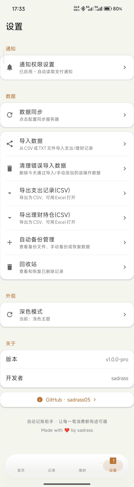
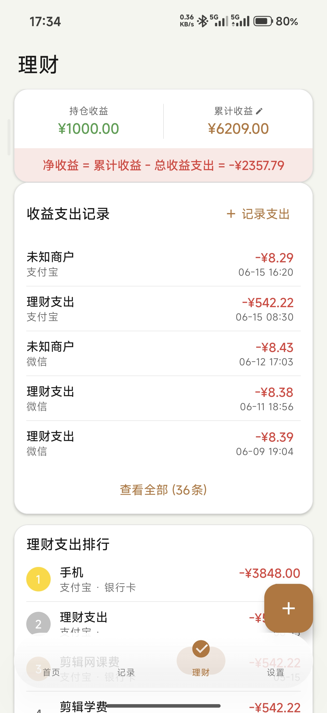
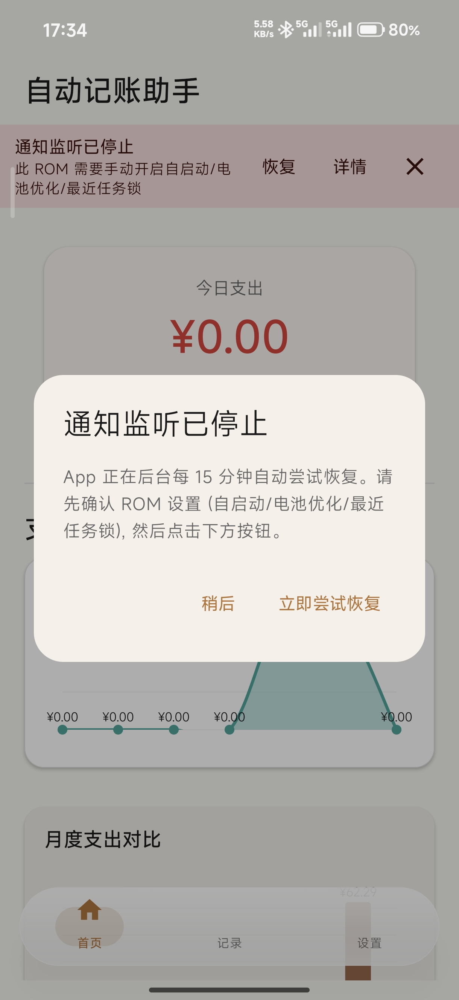
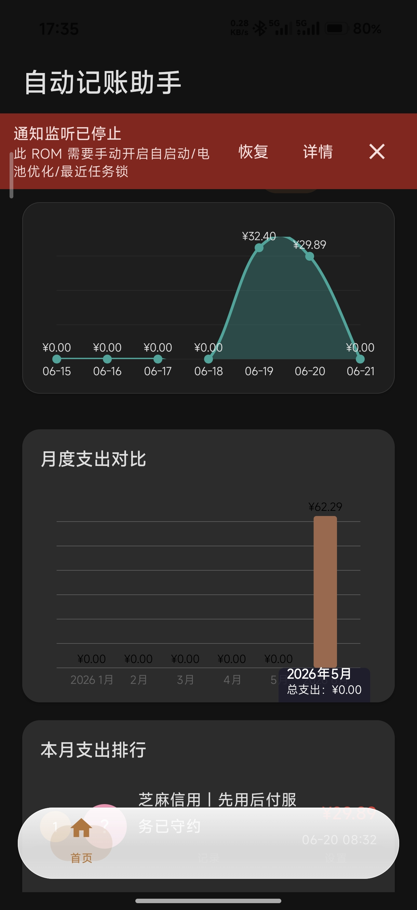

# 生活娱乐 | 自动记账助手 AutoBookkeeper

> 让每一笔消费有迹可循 —— 零手动操作，监听 14 个支付平台通知自动记账

---

## 1. Demo 简介

**是什么：** 一款 Android App，利用 NotificationListenerService 监听微信、支付宝等 14 个支付平台的通知，自动识别并记录每一笔消费，数据 100% 本地存储。

**面向谁：**
- 想记账但总是坚持不下来的上班族和学生（手动记账放弃率超 90%）
- 同时使用微信、支付宝、云闪付、美团、京东等多个支付平台的用户
- 对数据隐私敏感、反感借贷广告的用户

**主要功能：**

### 功能一：通知监听自动记账

付款后 App 在后台静默完成记账，用户完全无感。不需要打开 App，不需要选分类，不需要输金额——只需要正常用微信、支付宝付款。



### 功能二：14 平台智能解析

支持微信、支付宝、拼多多、云闪付、美团、京东、5 大银行、抖音、快手、滴滴共 14 个平台。5 级金额提取正则逐级降级匹配，9 级商户名提取，智能渠道识别（零钱通/余额宝/花呗/信用卡，甚至能识别拼多多"支付宝调用银行卡"的复合渠道）。



### 功能三：支出可视化分析

月度支出柱状图、7 天趋势折线图、支出分类环形饼图，消费结构一目了然。支持 CSV 导入导出和每周自动备份。





---

## 2. Demo 创作思路

**灵感来源：**

我了解到 Android 有个 NotificationListenerService，可以合法读取手机通知内容，不需要 root，不需要对接任何支付平台 API。微信、支付宝付完款后都会弹出一条通知，里面明明白白写着付给了谁、花了多少钱。既然如此，为什么不直接把这些通知抓下来自动记进数据库？这个思路绕过了获取支付平台数据接口的难题——只是读了一条本来就推送到手机上的通知而已。

**想解决的问题：**

1. **手动记账坚持不下来**：每次消费后要打开 App、选分类、输金额、确认保存，超过 90% 的用户一周内放弃
2. **支付数据散落各处**：微信、支付宝、云闪付、京东、美团账单互不相通，无法在一个地方统一查看
3. **自带钱包变借贷入口**：手机自带钱包 App 打开就是铺天盖地的借贷入口和分期推广
4. **数据安全焦虑**：多数记账 App 会把消费数据上传云端用于用户画像分析

**为什么做这个方向：**

三个判断让我决定做这个方向：
- **技术可行性**：NotificationListenerService 是 Android 系统内置 API，合法合规，不需要 root 或侵入其他 App
- **数据隐私**：所有数据存在本地，从设计层面拒绝数据变现路径
- **AI Agent 赋能**：我完全没有编程背景，但 Trae AI Agent 让我能从零做出一个完整 App——这本身就是 Agent 时代最好的注脚

---

## 3. Demo 体验地址

选择 **交互式 HTML 文件** 方式，已将 showcase.html 打包为 ZIP 上传。

📎 **体验文件**：AutoBookkeeper-Demo.zip（解压后用浏览器打开 showcase.html 即可）

HTML 展示页包含：
- Hero 首屏：项目名称 + 纯 CSS 模拟手机界面（含粒子动画、3D 倾斜）
- 痛点共鸣区：3 张核心痛点卡片（数字滚动动效）
- 核心功能展示区：1 个大手机 mockup + 3 个紧凑卡片（收支记录自动滚动、柱状图 hover 高亮、饼图液态玻璃质感）
- 通知监听流程图：4 节点流动光点动画
- 技术创新亮点区：5 个创新点卡片网格（磁吸光效）
- AI Agent 协作故事区：工作流图示 + 4 个真实踩坑案例
- 隐私与数据主权区：与主流记账 App 对比表
- 技术栈展示区：9 项技术选型网格

支持深色/浅色模式切换，响应式布局，全程动效。

---

## 4. TRAE 实践过程

### 开发流程

整个 App 几乎全部由 Trae AI Agent 协助完成。我的工作流是：

```
描述想法 → Trae 生成代码 → Android Studio 运行 → 遇错问 AI → 迭代修复
```

我不是程序员，完全不懂 Kotlin、Android 开发、Jetpack Compose。Trae 承担了从架构设计到代码实现再到 Bug 修复的全链路工作。

### 开发关键步骤

#### 步骤一：需求分析与架构设计

向 Trae 描述"想要监听微信支付通知自动记账"，Trae 设计了 NotificationListenerService 方案，规划了 MVVM 架构、Room 数据库、Hilt 依赖注入的技术选型。

> 📸 **开发截图 1**：[请插入 Trae 架构设计对话截图]

> 🔑 **Session ID 1**：1998271447841272:b029284f3f4087dfab6dce26c3b09711_69f963fa537075205648a05b.69f963fa537075205648a060.69f963fa537075205648a05c:TRAE Work CN.0.1.21.no_sid.no_ppe.T(2026/5/5 11:28:58)

#### 步骤二：核心功能实现

Trae 生成了 NotificationListener（通知监听）、PaymentParser（支付解析）、ExpenseRepository（数据存储）等核心模块。PaymentParser 支持了 14 个平台的通知解析，包含 5 级金额提取和 9 级商户名提取。

> 📸 **开发截图 2**：[请插入 Trae 代码生成对话截图]

> 🔑 **Session ID 2**：1998271447841272:5d102953d1426441afe97752d1abc2aa_69f963fa537075205648a05b.69f9681a537075205648a0ce.69f9681a537075205648a0ca:TRAE Work CN.0.1.21.no_sid.no_ppe.T(2026/5/5 11:46:34)
#### 步骤三：调试与踩坑修复

开发过程中遇到了多个技术难题，全部由 Trae 协助定位和修复。以下是 7 个真实踩坑案例：

**案例 1：StateFlow vs LiveData 混用**
ViewModel 中使用 StateFlow 但 UI 层错误调用 LiveData 专用的 observeAsState。Trae 定位后改为 collectAsStateWithLifecycle。

**案例 2：Hilt 与 Kotlin 2.1.x 不兼容**
Kotlin 2.1.x 的 Metadata 版本 2.1.0 超出旧版 Hilt 支持上限 2.0.0。Trae 建议升级 Hilt 到 2.56+。

**案例 3：ViewModel 无法实例化导致闪退**
MainViewModel 构造函数需要 Repository 参数但未接入 Hilt 注入。Trae 指导完成 ViewModel、Activity、Application 三处注解 + hiltViewModel 改造。

**案例 4：Composable 函数存入列表返回 Unit**
将 HomeScreen() 直接调用后存入列表返回 Unit 导致页面空白。Trae 指出需用 lambda 包裹实现延迟调用。

**案例 5：runtime-livedata 依赖版本变量未定义**
build.gradle 中使用了 $compose_version 变量但从未定义。Trae 建议使用 BOM 管理版本。

**案例 6：多个 @HiltAndroidApp 冲突**
项目已有 App.kt 带有 @HiltAndroidApp，又新建了 MyApplication.kt 导致冲突。Trae 定位后删掉重复文件。

**案例 7：LazyColumn contentPadding 类型错误**
contentPadding 参数类型是 PaddingValues，不能直接传 Dp。Trae 指导改为 PaddingValues(16.dp)。

> 📸 **开发截图 3**：[请插入 Trae 调试修复对话截图]

> 🔑 **Session ID 3**：1998271447841272:071de2b2a3d7ee551d26877ff31dd746_6a1aeb58125aa00a78d088e0.6a20e27293d3b4f0ce8d9e69.6a20e27293d3b4f0ce8d9e67:TRAE Work CN.0.1.21.no_sid.no_ppe.T(2026/6/4 10:26:58)

#### 步骤四：功能迭代与架构演进

从单版本到 Product Flavors 双版本架构，从基础记账到理财持仓管理，每次功能扩展都由 Trae 规划设计方案再逐步实现。包括：
- 国产 ROM 保活体系（RomDetector + NlsWatchdogWorker + NlsRestartWorker）
- 四层过滤防误判（黑名单 30+ 关键词 + 收入过滤 20+ 关键词 + 金额校验 + 防重复）
- 每周自动 CSV 备份和一键导入导出
- Pro 版 MySQL 局域网同步

### AI Agent 协作心得

Agent 时代的到来，确实给了普通人一次自定义工具的机会。放在以前，我这种没有任何编程背景的人想为自己做一个记账 App 简直是天方夜谭。虽然现在做出来的东西远不能跟大公司打磨多年的商业产品比——UI 不够精致、兼容性偶尔翻车——但至少，我需要什么功能，我就加什么功能。不需要忍受广告，不需要付费订阅，数据不会被拿去分析用户画像。

这个项目本身就是 Agent 时代最好的注脚：一个零编程背景的普通用户，借助 Trae AI Agent，从零做出了一个包含通知监听、14 平台智能解析、国产 ROM 保活、双版本架构、理财管理、局域网数据同步的完整 Android 应用。

---

## 报名帖链接

> [请填入社区报名帖链接]

---

> 项目开源地址：https://github.com/sadrass05/autokeeper
> License：MIT
